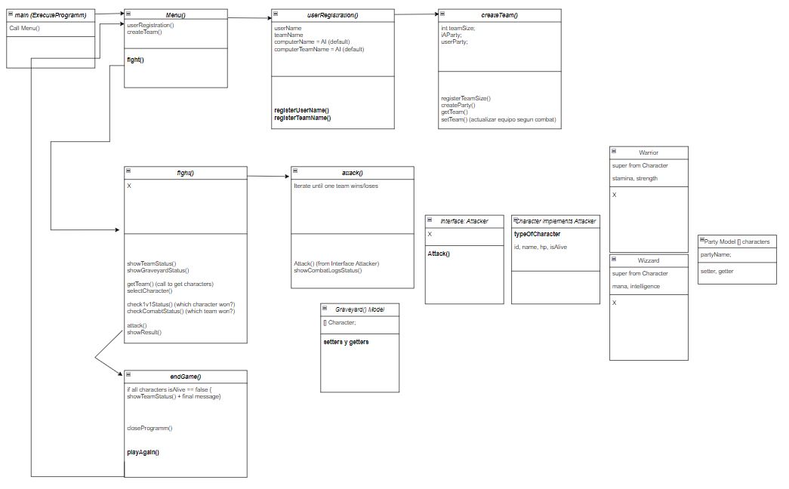

### Diagrama UML


### Trello
[Trello](https://trello.com/b/22SSvND3/ironhack-rpg-game)

### To run application
With Intellij: Open the project with Intellij and run Main file   
With CLI: position yourself in Src folder and Execute:  
To compile:  
```Javac Main.java```  
To run:  
```Java Main```

